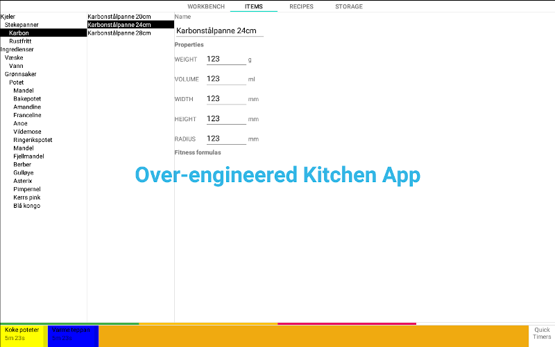

# Kitchen Timer
An over-engineered kitchen timer to learn Android programming and to actually enjoy the app in the kitchen, collecting
recipes, executing recipes and keep the fridge and freezer tidy using the logistics feature.

Look at its features here: [Features](doc/Features.md)

## Current state

Very WIP. Mostly layout and the database structure has been planned and implemented.
